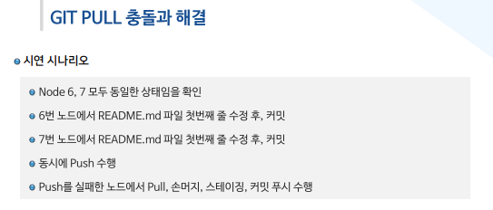
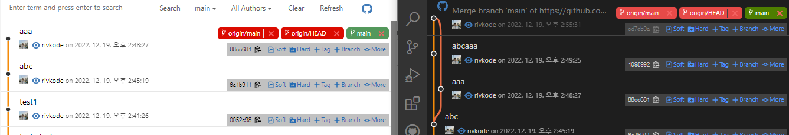

# Git pull confilct

> pull = fetch + merge

fetch 는 원격을 가져오는 과정이기 때문에 이 과정에서 충돌은
절대 발생하지 않습니다.

merge는 항상 로컬(내PC)에 있는 브랜치 사이에서만 발생하는 작업입니다.

(원격 상관없음)

시연 시나리오

개발자 A, B 가 있음
현재는 동일 노드를 바라봄

A 1.md push

B 1.md push (A push파일(1.md)을 pull 하지 않은 상태) -> confilct

어떻게 해결할까 ?

 

## 충돌이 난 이유는 ?

개발자 B가 push할 당시 개발자 A가 push 한 1.md 파일을 업데이트하지 않았으므로 충돌이 난 것.

즉 다른 git log를 가진 상태에서 push는 불가하다.

reset, rebase, merge를 통해서 git log를 개발자 A의 상태와 맞춰준 후 merge를 하여야만 git push가 가능하다.

vscode에서는 친절하게도 클릭 한 번으로 이러한 merge기능을 제공한다.

merge를 하게되면 아래와 같이 git log가 정리되는 것을 볼 수 있다.
(왼쪽 개발자 A, 오른쪽 개발자 B)

