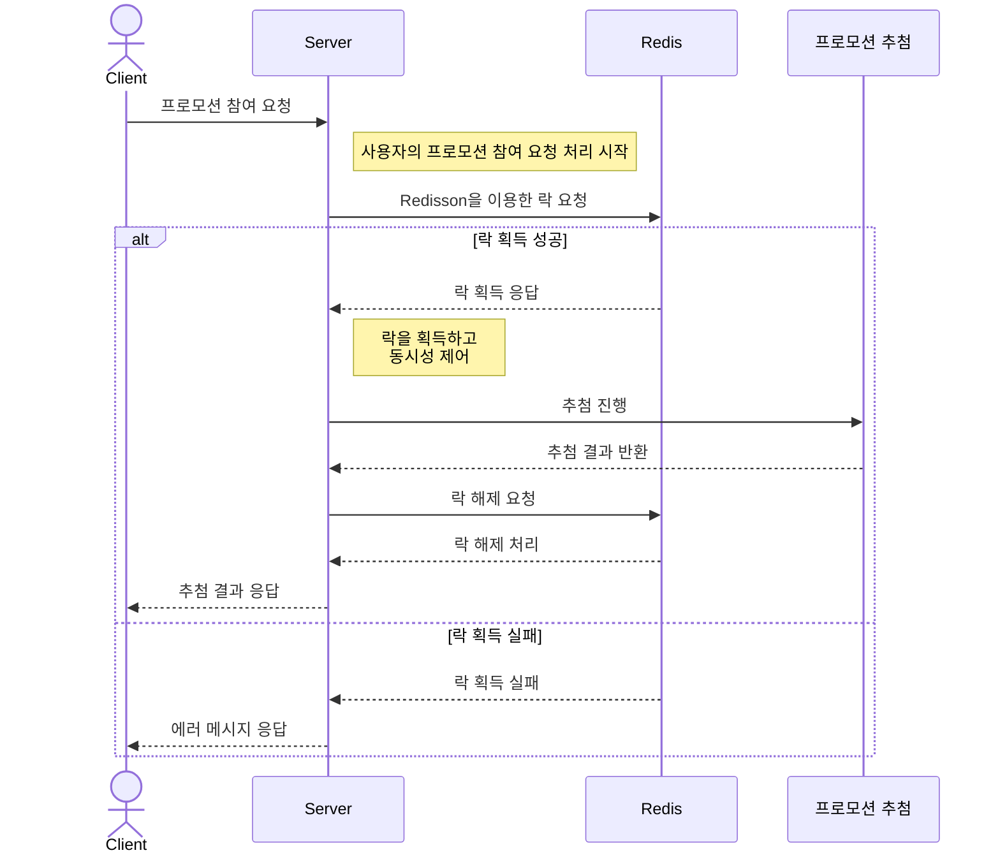

# 스레드 안전성

**들어가며**

스레드와 락은 병령 프로그램을 작성하려면 잘 사용해야 한다. 하지만 스레드에 안전한 코드를 작성하는 것은
근본적으로는 상태, 특히 공유되고 변경할 수 있는 상태에 대한 접근을 관리하는 것이다.

여기서 공유되고 변경할 수 있는 상태에 대한 접근이 뭘까 ?

임계영역에 대해서 문제가 발생하지 않도록 하는 것.
이를 위해 스레드에 대한 동기화를 락으로 적절히 관리해줘야 한다.
왜냐하면 2개 이상의 스레드가 하나의 자원에 대해 수정하게 되면 일관성이 무너지게 되므로

스레드 안전성은 데이터를 보호한다는 개념이라기 보다는 스레드 간의 데이터에 대한 제어를 통해 
무분별한 접근을 막으려는 것이다. 그러므로 스레드가 안전하다는 것은 해당 객체에 여러 스레드가 접근할지의
여부에 달린 것이다.

하나 이상의 스레드가 상태 변수에 접근하여 값을 변경한다면 그 변수에 접근할때 관련된 모든 스레드가 동기화를
통해 조율이 되어야 한다.
자바에서의 동기화 기본 수단은 `synchronized` 이며 베타적인 락을 통해 보호가 가능하다.

 

공유되는 자원에 대해서 만약 동기화가 이루어지고 있지 않다면 이는 "잘못된 프로그래밍"이다.

이를 올바르게 고치기 위해서는
1. 해당 상태 변수를 스레드 간에 공유하지 않는다.
2. 해당 상태 변수를 변경할 수 없도록 만든다.
3. 해당 상태 변수를 접근할 땐 항상 동기화를 사용한다.

그러므로 클래스를 설계할때에는 처음부터 스레드 동기화를 고려하여 설계하도록 하자.

만약 스레드 안전한 클래스를 설계하려고 할때면, 객체 지향 기법이 적절하다. 캡슐화와 불변 객체를 잘 활용하고,
불변 조건을 명확하게 해보자.

스레드 안전한 클래스라는 말이 의미가 있으려면, 클래스는 자신의 상태를 캡슐화해야만 의미가 있다.

 

**스레드 안전성이란 ?**

정의하기 까다롭다.
예를 들어 아래와 같이 정의할 수 있겠다.
- 여러 프로그램 스레드에서 스레드 간에 원치 않는 상호 작용 없이 서로를 호출 할 수 있는 ..
- 호출하는 측에서 별다른 작업을 하지 않고도 여러 스레드에서 동시에 호출할 수 있는 ..

"스레드 안전하다" 라는 말은 어떤 의미일까 ?

방금 스레드 안전성을 정의할 때 까다롭고 헷갈렸던 이유는 객체 상태에 대해 "정확성"을 언급하지 않아서 이다.

여러 스레드가 동시에 특정 클래스에 접근하여 동작할때 계속해서 의도한대로 정확하게 동작한다면 해당 클래스는
스레드에 안전하다라고 할 수 있다. 즉, 호출하는 쪽에서 따로 동기화를 하고 여러 스레드에서 클래스를 동시에
여러 스레드로 접근하여도 계속해서 정확하게 동작한다면 해당 클래스는 안전하다라고 할 수 있다.

객체가 제대로 구현이 되었다면, 싱글 스레드 환경이던 멀티 스레드 환경이던 일련의 작업이 진행된 이후에 
인스턴스를 잘못된 상태로 만들 수 없다.

sequence diagram test

